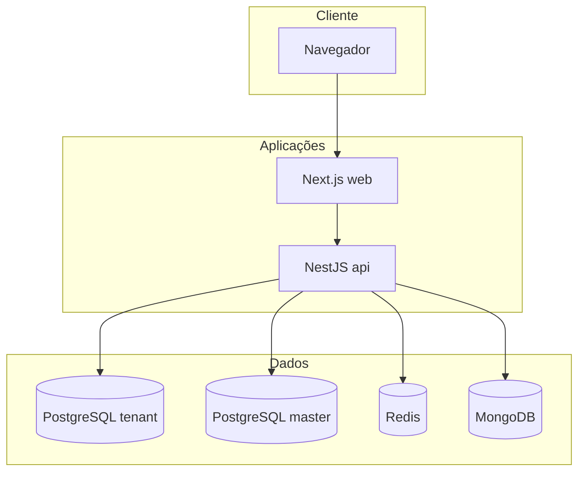

# Arquitetura

## Monorepo

O repositório usa **pnpm workspaces** e **Turborepo** para orquestrar builds e `dev`.

```text
GestorAdv/
├── apps/
│   ├── api/          # NestJS — API REST
│   └── web/          # Next.js — interface web
├── packages/
│   ├── database/     # Prisma (schema tenant + master)
│   ├── tsconfig/     # Bases TypeScript compartilhadas
│   └── validators/   # Schemas Zod compartilhados
├── services/         # Pacotes auxiliares (chatbot, scraper, document-generator)
├── tools/            # Scripts operacionais (license-manager, tenant-provisioner)
├── docker-compose.yml
├── package.json
├── pnpm-workspace.yaml
└── turbo.json
```

Workspaces declarados em [`pnpm-workspace.yaml`](../pnpm-workspace.yaml): `apps/*`, `packages/*`, `services/*`.

## Componentes em runtime



- **Standalone**: normalmente um único PostgreSQL “tenant” (`DATABASE_URL`) com tabela `Escritorio` e licença local; `MASTER_DATABASE_URL` pode existir para ferramentas, mas o fluxo principal de licença é o do escritório.
- **SaaS**: PostgreSQL **master** com `Tenant`, `TenantLicense`, `TenantPlan`; cada tenant pode ter `databaseUrl` próprio; o middleware resolve o tenant e o `LicenseGuard` valida licença no master.

## Modos de deploy

| Modo | Variável | Comportamento resumido |
|------|----------|-------------------------|
| Standalone | `DEPLOYMENT_MODE=standalone` (padrão em `.env.example`) | Licença no registro `Escritorio` do banco tenant; sem exigência de subdomínio/header de tenant nas rotas normais. |
| SaaS | `DEPLOYMENT_MODE=saas` | Middleware de tenant ativo; identificação por `X-Tenant-ID` (slug) ou subdomínio; licença em `TenantLicense` no master. |

Detalhes em [Autenticação e multitenancy](07-autenticacao-e-multitenancy.md).

## API global

- Prefixo: **`/api`** (ex.: `/api/auth/login`).
- Guard global: `LicenseGuard` (com exceções para health, auth, escritório, webhooks, admin, etc.).
- Swagger UI: **`/api/docs`**.

## Pool de conexões multi-tenant

O serviço [`TenantPrismaService`](../apps/api/src/tenant/tenant-prisma.service.ts) mantém um pool de clientes Prisma por `databaseUrl`, com limpeza de conexões ociosas. Em modo SaaS, isso sustenta um banco dedicado por escritório quando configurado no cadastro do tenant.
